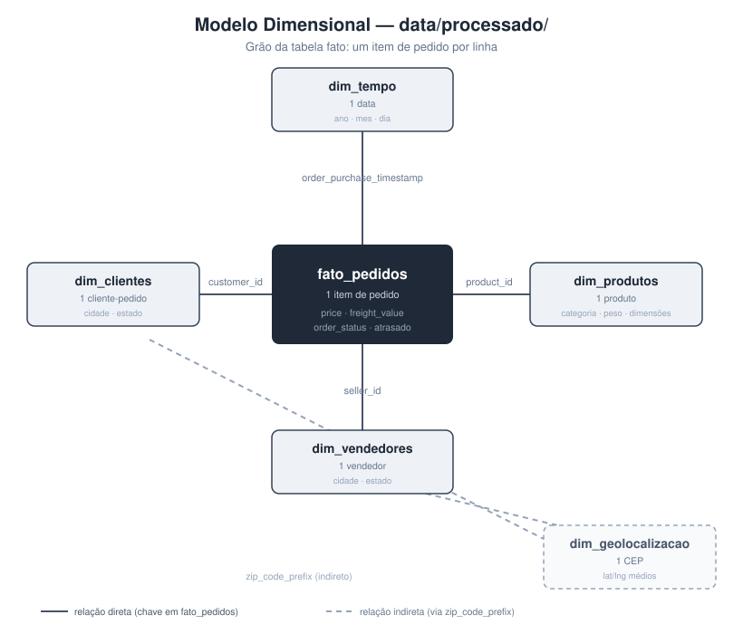

# Dicionário de Dados e Racional Técnico — Case Olist

Documentação de referência das 9 tabelas do dataset e das decisões técnicas dos
notebooks de compreensão e preparação dos dados. Fonte: [Kaggle — Brazilian E-Commerce
Public Dataset by Olist](https://www.kaggle.com/datasets/olistbr/brazilian-ecommerce).

Validado com os dados reais em 11/08/2026, com os KPIs consolidados a partir
do notebook `03_kpis_principais.ipynb`. Tipos, volumetria, nulos e
cardinalidade refletem os CSVs carregados em `data/base/`. Detalhamento completo
por coluna em `documentos/data_quality_summary.csv`.

**Período coberto:** 04/09/2016 a 17/10/2018 — o volume relevante de pedidos vai
de **jan/2017 a ago/2018**. Set-dez/2016 (329 pedidos) e set-out/2018 (20
pedidos) têm volume quase nulo e devem ser excluídos ou tratados à parte em
qualquer gráfico de evolução mensal, sob risco de distorcer a trilha de
Crescimento.

---

## 1. Dicionário de Dados

### `olist_customers_dataset` (Clientes) — 99.441 linhas

| Coluna | Tipo real | Descrição | Chave |
|---|---|---|---|
| customer_id | texto | ID do cliente **por pedido** (muda a cada compra) | PK |
| customer_unique_id | texto | ID único e persistente do cliente — usar para RFM/recompra | — |
| customer_zip_code_prefix | inteiro | Prefixo do CEP do cliente | FK → geolocation |
| customer_city | texto | Cidade do cliente | — |
| customer_state | categoria (UF) | Estado do cliente | — |

Achado: 96.096 `customer_unique_id` para 99.441 `customer_id` → apenas **3,36%
de recompra** identificável — baixo para uma narrativa de retenção.

### `olist_orders_dataset` (Pedidos) — 99.441 linhas

| Coluna | Tipo real | Descrição | Chave |
|---|---|---|---|
| order_id | texto | ID único do pedido | PK |
| customer_id | texto | Referência ao cliente daquele pedido | FK → customers |
| order_status | categoria | delivered (97,0%), shipped (1,1%), canceled (0,6%), unavailable (0,6%), invoiced (0,3%), processing (0,3%), created/approved (<0,01%) | — |
| order_purchase_timestamp | datetime | Data/hora da compra — 0% nulos | — |
| order_approved_at | datetime | Data/hora da aprovação — 0,16% nulos | — |
| order_delivered_carrier_date | datetime | Data de postagem — 1,79% nulos | — |
| order_delivered_customer_date | datetime | Data real de entrega — 2,98% nulos (só em pedidos não `delivered`) | — |
| order_estimated_delivery_date | datetime | Data estimada de entrega — 0% nulos | — |

Uso principal: lead time e atraso = `order_delivered_customer_date` −
`order_estimated_delivery_date`.

### `olist_order_items_dataset` (Itens do Pedido) — 112.650 linhas

| Coluna | Tipo real | Descrição | Chave |
|---|---|---|---|
| order_id | texto | Referência ao pedido | FK → orders |
| order_item_id | inteiro | Número sequencial do item dentro do pedido | — |
| product_id | texto | Referência ao produto | FK → products |
| seller_id | texto | Referência ao vendedor | FK → sellers |
| shipping_limit_date | datetime | Prazo limite para o seller postar o item | — |
| price | decimal | Preço do item (sem frete) | — |
| freight_value | decimal | Valor do frete daquele item | — |

Achado: média de 1,14 item por pedido (máximo 21) — a maioria dos pedidos tem 1 item só.

### `olist_order_payments_dataset` (Pagamentos) — 103.886 linhas

| Coluna | Tipo real | Descrição | Chave |
|---|---|---|---|
| order_id | texto | Referência ao pedido | FK → orders |
| payment_sequential | inteiro | Sequência (pedido pode ter múltiplos pagamentos) | — |
| payment_type | categoria | credit_card, boleto, voucher, debit_card | — |
| payment_installments | inteiro | Número de parcelas | — |
| payment_value | decimal | Valor pago | — |

### `olist_order_reviews_dataset` (Avaliações) — 99.224 linhas

| Coluna | Tipo real | Descrição | Chave |
|---|---|---|---|
| review_id | texto | ID da avaliação | PK |
| order_id | texto | Referência ao pedido | FK → orders |
| review_score | inteiro (1–5) | Nota do cliente — média geral 4,16 (pedidos entregues, ver seção 3) | — |
| review_comment_title | texto | Título do comentário — 88,3% nulos (campo opcional) | — |
| review_comment_message | texto | Corpo do comentário — 58,7% nulos (campo opcional) | — |
| review_creation_date | datetime | Data de envio da pesquisa de satisfação | — |
| review_answer_timestamp | datetime | Data de resposta do cliente | — |

### `olist_products_dataset` (Produtos) — 32.951 linhas

| Coluna | Tipo real | Descrição | Chave |
|---|---|---|---|
| product_id | texto | ID do produto | PK |
| product_category_name | categoria | Categoria em português — 610 nulos (73 categorias distintas) | FK → category_translation |
| product_name_lenght | decimal | Nº de caracteres do nome do produto | — |
| product_description_lenght | decimal | Nº de caracteres da descrição | — |
| product_photos_qty | decimal | Quantidade de fotos | — |
| product_weight_g | decimal | Peso em gramas | — |
| product_length_cm | decimal | Comprimento em cm | — |
| product_height_cm | decimal | Altura em cm | — |
| product_width_cm | decimal | Largura em cm | — |

### `olist_sellers_dataset` (Vendedores) — 3.095 linhas

| Coluna | Tipo real | Descrição | Chave |
|---|---|---|---|
| seller_id | texto | ID do vendedor | PK |
| seller_zip_code_prefix | inteiro | Prefixo do CEP do seller | FK → geolocation |
| seller_city | texto | Cidade do seller | — |
| seller_state | categoria (UF) | Estado do seller | — |

### `olist_geolocation_dataset` (Geolocalização) — 1.000.163 linhas

| Coluna | Tipo real | Descrição | Chave |
|---|---|---|---|
| geolocation_zip_code_prefix | inteiro | Prefixo do CEP | FK (para customers/sellers) |
| geolocation_lat | decimal | Latitude | — |
| geolocation_lng | decimal | Longitude | — |
| geolocation_city | texto | Cidade | — |
| geolocation_state | categoria (UF) | Estado | — |

Achado: 261.831 linhas duplicadas e apenas 19.015 `zip_code_prefix` únicos para
1 milhão de linhas — esperado (várias coordenadas por CEP). Agregar (ex.: média
de lat/lng por prefixo) antes de usar em mapas, em vez da tabela bruta.

### `product_category_name_translation` (Tradução de Categorias) — 71 linhas

| Coluna | Tipo real | Descrição | Chave |
|---|---|---|---|
| product_category_name | categoria | Nome da categoria em português | FK → products |
| product_category_name_english | categoria | Nome da categoria em inglês | — |

---

## 2. Modelo Relacional

```
customers ──< orders ──< order_items >── products >── category_translation
                │            │
                │            └──< order_items >── sellers
                ├──< order_payments
                └──< order_reviews

customers.customer_zip_code_prefix ──> geolocation
sellers.seller_zip_code_prefix     ──> geolocation
```

### Modelo Dimensional (`data/processado/`, gerado pelo notebook 02)



| Tabela | Grão | Principais colunas |
|---|---|---|
| `fato_pedidos` | 1 item de pedido | order_id, product_id, seller_id, customer_id, price, freight_value, order_status, atrasado |
| `dim_clientes` | 1 cliente-pedido | customer_id, customer_unique_id, customer_city, customer_state |
| `dim_produtos` | 1 produto | product_id, categoria (PT/EN), peso, dimensões |
| `dim_vendedores` | 1 vendedor | seller_id, seller_city, seller_state |
| `dim_tempo` | 1 data | data, ano, mes, dia, ano_mes |
| `dim_geolocalizacao` | 1 CEP | zip_code_prefix, lat/lng médios, cidade, estado |

`payment_value` (de `order_payments`) foi deixado fora da tabela fato de propósito:
está no grão de pedido, não de item, e juntar direto duplicaria o valor pago em
pedidos com mais de um item. Ao precisar desse valor, agregar `order_payments`
por `order_id` separadamente.

---

## 3. KPIs e Achados Principais

Calculados no notebook `03_kpis_principais.ipynb`, a partir de `data/processado/`
(mais rigoroso que uma exploração inicial: usa a tabela fato já modelada e
deduplica por pedido antes de calcular médias de logística/satisfação, para não
inflar pedidos com mais de um item). Base: 98.666 pedidos únicos, jan/2017 a
ago/2018.

### Crescimento e Receita

| KPI | Valor |
|---|---|
| Receita total | R$ 13.591.643,70 |
| Crescimento médio mês a mês | 14,2% |
| Ticket médio geral (AOV) | R$ 137,75 |
| Top 5 categorias (% da receita) | 39,7% — health_beauty (R$ 1,26M), watches_gifts, bed_bath_table, sports_leisure, computers_accessories |
| Concentração em SP | 38,3% da receita (R$ 5,2M de R$ 13,59M) |
| Top 10 sellers (% da receita) | 13,1%, de 3.095 sellers no total |
| Taxa de recompra | 3,36% |

### Logística e SLA

| KPI | Valor |
|---|---|
| Lead time médio (compra → entrega) | 12,1 dias |
| Pedidos no prazo (SLA compliance) | 91,9% (8,1% atrasados) |
| Atraso médio, entre os atrasados | 8,9 dias (7.826 pedidos) |
| Piores estados por lead time | RR (29,0d), AP (26,7d), AM (26,0d), AL (24,0d), PA (23,3d) |
| Frete médio | R$ 19,99 |
| Frete / preço | 16,6% |

### Satisfação

| KPI | Valor |
|---|---|
| Nota média geral | 4,16 |
| Nota média — pedidos no prazo | 4,29 |
| Nota média — pedidos atrasados | 2,57 |
| Avaliações negativas (nota ≤ 2) | 12,8% |

### KPI Executivo Combinado — Receita em Risco por Atraso Logístico

Receita de pedidos atrasados, ponderada pela queda percentual na nota de
avaliação (proxy de risco de não-recompra) — conecta as duas trilhas em uma
única cifra financeira:

| Componente | Valor |
|---|---|
| Receita em pedidos atrasados | R$ 1.158.920,51 |
| Queda percentual na nota (atrasado vs. no prazo) | 40,2% |
| **Receita em risco** | **R$ 466.199,44** |

Lembrete de correlação x causalidade (Aula 1 de Estatística): a diferença de
nota entre pedidos no prazo e atrasados é grande e provavelmente relevante, mas
o relatório final deve deixar claro que é uma associação observacional — outros
fatores (categoria, região, valor do pedido) podem influenciar os dois lados.

---

## 4. Qualidade dos Dados

| Item | Status | Observação |
|---|---|---|
| Duplicidades | Verificado | 0 duplicadas em 8 das 9 tabelas; `geolocation` tem 261.831 linhas duplicadas (tratar na modelagem) |
| Valores nulos críticos | Verificado | `order_delivered_customer_date` nulo só em pedidos não entregues (esperado, não é erro) |
| Nulos não-críticos | Verificado | `review_comment_title`/`review_comment_message` nulos são campos opcionais |
| Outliers | Documentado | `price` (até R$ 6.735) e `freight_value` (até R$ 409,68) documentados via `describe()`; nenhum valor removido — decisão de tratamento fica para quando alguma análise específica precisar |
| Consistência de datas | Verificado | 1.359 pedidos (1,37%) com postagem antes da aprovação e 23 pedidos (0,02%) com entrega antes da postagem — inconsistências pontuais nos timestamps, volume baixo o suficiente para não comprometer as análises agregadas |
| Cobertura temporal | Verificado | Volume real: jan/2017 a ago/2018. Isolar set-dez/2016 e set-out/2018 nas séries temporais |
| Granularidade | Confirmada | 1 linha em `order_items` = 1 item de um pedido (média 1,14 item/pedido, máx. 21) |

---

## 5. Racional Técnico dos Notebooks

Resumo das principais decisões de código dos notebooks `01_compreensao_dos_dados.ipynb`,
`02_preparacao_dos_dados.ipynb` e `03_kpis_principais.ipynb`, e por que foram tomadas —
apoio para justificar escolhas técnicas junto aos professores, no vídeo executivo ou na
apresentação.

| Decisão | Racional |
|---|---|
| Carregar cada tabela em uma variável própria, com um `pd.read_csv` por arquivo | Deixa explícito qual arquivo vira qual tabela, sem abstrações — fácil de acompanhar e de depurar linha por linha |
| Checar shape, `head()`, nulos e duplicados tabela por tabela, com comandos separados | Cada checagem fica visível e independente, sem depender de entender uma função auxiliar antes de ler o resultado |
| Converter as datas de `orders` com `pd.to_datetime` antes de qualquer análise | Datas em texto impedem cálculo de lead time e agrupamento por mês; o dataset não tem datas malformadas, então a conversão direta é suficiente |
| Checar granularidade de `order_items` e `customer_id` vs `customer_unique_id` | Evita contar receita em duplicidade em joins e contar clientes errado em métricas de recompra |
| Olhar o status dos pedidos sem data de entrega, em vez de só contar os nulos | Mostra que os nulos são esperados (pedidos não entregues), não erro de qualidade — evita limpeza indevida e aplica o cuidado de correlação x causalidade antes de cruzar atraso com nota |
| Reunir os resultados em uma lista e montar a tabela de resumo no final | Não exige definir função; gera o `data_quality_summary.csv`, artefato versionável que alimenta este dicionário sem digitação manual |
| Olhar `describe()` de `price`, `freight_value` e `product_weight_g` sem remover nada | Documenta os extremos (ex.: preço até R$ 6.735, frete até R$ 409,68) para o grupo decidir junto o tratamento — remover outlier sem alinhar com quem usa os dados pode distorcer as análises de Crescimento e Logística |
| Tabela fato no grão de item de pedido (`fato_pedidos`), não de pedido | É o nível mais detalhado disponível — dá para agregar por pedido, por dia, por categoria etc. depois, sem perder informação; grão mais alto (pedido) perderia o detalhe de item |
| Deixar `payment_value` fora da tabela fato | `order_payments` está no grão de pedido; juntar direto ao grão de item duplicaria o valor pago em pedidos com mais de um item |
| Agregar `geolocation` por `zip_code_prefix` (média de lat/lng) antes de virar dimensão | A tabela original tem várias linhas por CEP; sem agregar, `dim_geolocalizacao` teria duplicidade e quebraria qualquer join 1-para-1 com clientes/vendedores |
| Usar `.gitkeep` (arquivo vazio) em `data/base/` e `data/processado/` | Garante que essas pastas apareçam no repositório mesmo sem CSVs versionados — o Git não rastreia pastas vazias por padrão |
| Comparar cada par de datas sequenciais de `orders` (compra/aprovação/postagem/entrega) | Confirma a ordem lógica dos timestamps; identificou 1.382 pedidos com alguma inconsistência pontual, volume baixo o suficiente para não comprometer análises agregadas |
| Carregar `order_reviews` direto de `data/base/`, não de `data/processado/` | `review_score` ainda não faz parte do modelo dimensional; evita modelar uma tabela nova só para este cálculo pontual |
| Deduplicar `fato_pedidos` por `order_id` antes de calcular KPIs de pedido (lead time, atraso, nota) | `fato_pedidos` está no grão de item; sem deduplicar, pedidos com mais de um item pesariam mais nas médias — inflando ou distorcendo o resultado |
| Excluir set-dez/2016 e set-out/2018 do cálculo de crescimento mês a mês | Volume quase nulo nesses meses (já documentado na Cobertura Temporal) distorceria a taxa de crescimento se incluído |

**Como isso atende aos critérios de avaliação:**

| Critério | Contribuição |
|---|---|
| Governança | Código documentado, checagens explícitas de nulos/duplicidade/granularidade, resultado exportado e versionado, execução reprodutível |
| Capacidade analítica | Achados já quantificados (atraso x nota, recompra) orientam as trilhas com números, não suposições |
| Storytelling | O alerta sobre meses com dado quase inexistente evita um erro de narrativa (mostrar "queda" de receita que na verdade é ausência de dado) |

---

## Template para Novas Decisões

Ao adicionar um novo notebook a este projeto, incluir uma linha nesta tabela
seguindo o mesmo padrão:

| Decisão | Racional |
|---|---|
| `<o que foi feito>` | `<por que essa abordagem, o que evita, e a que critério de avaliação se conecta>` |
